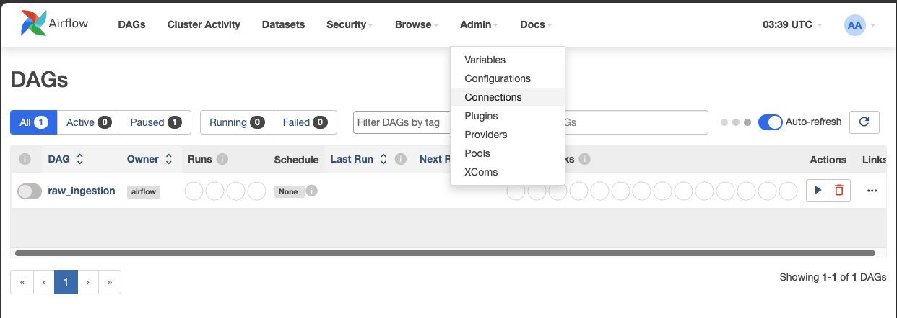

# data_wow_test

STEP 1.
- `git clone https://github.com/thanatthuch/data_wow_test.git`
- `cd data_wow_test`
- `python3 sampledata_new.py`  (wait process has done)

STEP 2.

- `docker-compose up -d`

wait all process runing succeeded (can check on `docker ps` command)

- open Airflow Ui on browser via link : http://localhost:8080
- login username: `airflow`
- login password: `airflow`

go to Navbar top, point to admin then choose connection to add DB connection

select `+` symbol to Add a new record connection

Configuration the setting
- Connection id: *the same name as python DAG file postgres connection named.*
- Connection Type: *Postgres*
- Host: *Postgres or URL to link into host of postgresSQL DB*
- Schema: *Schema name or Database name to connection.*
- Login & Password: *Username and Password to login Database*
- Port: *port of database*

Click Save

go back to DAGs (on Navbar)

in the table will show DAG process of raw_ingest on the right screen click Action play button.

in the table click DAGs name (`raw_ingestion`) to monitor the process

Click on the `Graph` to view the workflow pipeline.

Check the log files for each task to verify if they are running correctly as intended.

* Check the logs for the file conversion process.

* Create_table logs

* Truncate_table logs

* Verify the file loading process into the target table by checking the logs.

####  Process time
 - File transformation 9.43 minutes
 - Loading file duration 18.50 minutes
 - Total duration 28.49 minuts

#### Data validation
Count scan

Basic scan

# Testing end - Thank you
